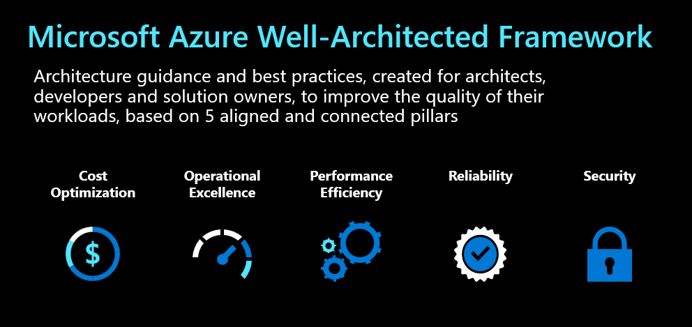
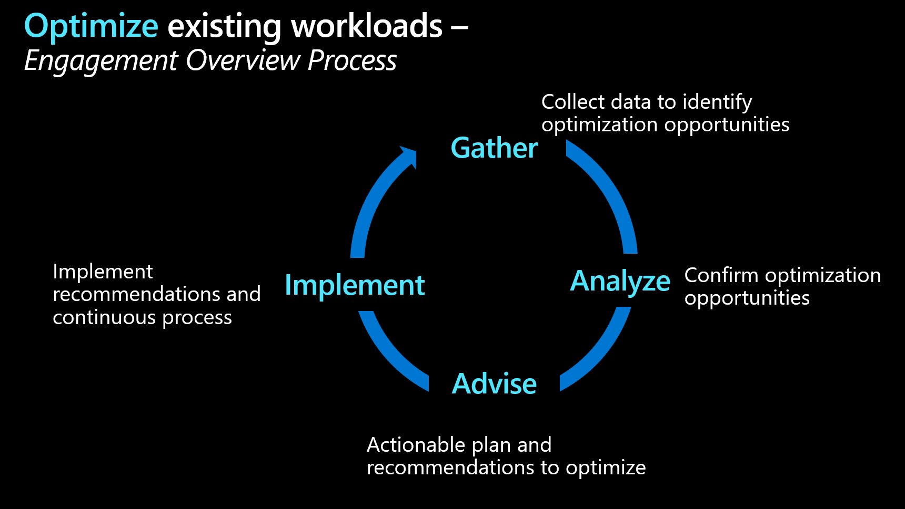
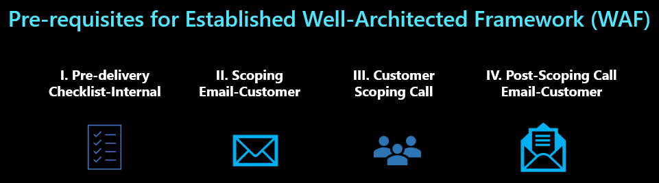

### **Establish WAF for Modernizing your Data Estate with Azure SQL**

#### (Duration - 40 Hours) *Duration is an approximate, can be adjusted

#### **A. Objective 🎯**

The goal of Azure WAF is to provide our customers set of guiding tenets that can be used to improve their environment, enhance business confidence and maximize the value on their investment by making sure that the environment is being used to its full potential. Through the WAF assessment we can deliver prioritized and actionable recommendations to address each risk to improve the customer’s workload in a Well-Architected state.  The WAF focuses on **5 pillars**:  

- Increasing **Reliability**
- **Cost** Optimization
- Enhancing **security**
- Drive **Performance** Efficiency
- **Operational** Excellence

  

The engagement consists of **4** stages or steps:

1. Gather
2. Analyze  
3. Advise
4. Implement

 

#### **B. Pre-requisites**

Please review the pre-requisites carefully. The purpose of this step  is to ensure expectations are set, prerequisites are met, stakeholders are identified, and outputs are clear. A key element in this phase is to minimize surprises.  After completing these steps all the key stakeholders - Customer, CSAM, you or anyone else should be on the same page in terms of engagement, logistics, operational items and more. The pre-requisites for this stage is broken down into **4** tasks as explained below.

[!INCLUDE [Pre-Delivery Checklist](~/VBD-FY24/CommonContent/PredeliveryChecklist.md)]

  > 💡**Tip**
  >
  > The goal of the internal scoping call is to gather as much information as possible prior to the scoping call with the customer.

  | **Reference: Internal Scoping Deck** 📖|
  |---------         |
  |[Pre-scoping internal kickoff presentation deck - Well-Architected Assessment for Data Platform](https://microsoft.sharepoint.com/:f:/r/teams/DataAIPremierOfferings/Production/Maintain/Assessment_Program/Well-Architected%20Assessment%20for%20Data%20Platforms/2-PreScoping%20Call%20Artifacts?csf=1&web=1&e=fRs4dO)|

- **Scoping Email - Customer**

  The scoping email is sent by the CSA to the primary customer point(s) of contact, CSAM, CSA, and Microsoft account team as applicable. The customer point of contact should be the representative responsible for coordinating logistics, requirements, and stakeholders. Typically, the scoping email recipients are the stakeholders who will participate in the assessment.
  
  | **Reference: Scoping Email - Customer** 📖|
  |---------         |
  |[Scoping call email template - Well-Architected Assessment for Data Platform](https://microsoft.sharepoint.com/:f:/r/teams/DataAIPremierOfferings/Production/Maintain/Assessment_Program/Well-Architected%20Assessment%20for%20Data%20Platforms/2-PreScoping%20Call%20Artifacts?csf=1&web=1&e=fRs4dO)|
  
  The purpose of this email is as follow:
  
  - Convey the date and time of the
  - Scheduled scoping call
  - Provide a high level agenda for the scoping call
  - Provide technical requirements to run Azure Workbooks
  
  > **Note**
  >
  > The email should be sent as soon as a scoping call is scheduled with customer, CSAM, and delivery resource. Ideally, it is several business days prior to the scoping call to give the customer time to complete the technical pre-requisites.

[!INCLUDE [Customer Scoping](~/VBD-FY24/CommonContent/ScopingGeneral.md)]

  - Have they conducted any WAF, Go-Live or any other kind of assessment for their environment.  If possible, please get the results if they have conducted once in the past.  
  - Are they experiencing any issues or have any concerns related to the 5 WAF pillars (cost optimization, operational excellence, performance efficiency, reliability and security).
  - What specific Azure workload will be assessed.
  - Discuss engagement logistics and scheduling.
  - Subscription IDs for Azure Advisor data

  > 💡**Tip**
  >
  > The Well-Architected Assessments are focused on a specific production Azure workload. A 'workload' or 'application' is a resource or collection of resources that provide end-to-end functionality to one or multiple clients (humans or systems). Also, workload can be an end-to-end scenario (a process, a journey, a business operation) and the IT infrastructure supporting it. It can be one or multiple applications, APIs and databases working together to deliver a specific functionality.
  
  | **In Scope**  |
  |---------         |
  |A single production run-state workload environment  |
  |5 WAF Pillars - Cost, Operations, Performance, Reliability & Security|

  | **Out of Scope**  |
  |---------         |
  |Remediation during the assessment phase |
  |Customization of Azure Monitor Workbook|
  |Multiple production run-state workload environment|

  | **Success Criteria for the WAF Engagement** 🏅 |
  |---------         |
  |Customer has complete understanding of the Data Platform environment from the lens of Well-Architected Framework (WAF)|
  |Comprehensive report covering key findings and prioritized recommendations shared with the customer|
  |Customer understood the findings and recommendations. Customer committed to execute the top three recommendations|
  |Assessment report containing next steps for committed recommendations|
  |Improvement plan handed off to the CSA or CSAM for follow ups and review with customer|

  | **Reference: Scoping PPT Deck** 📖|
  |---------         |
  |[Scoping Call Deck - Well-Architected Assessment for Data Platform](https://microsoft.sharepoint.com/:f:/r/teams/DataAIPremierOfferings/Production/Maintain/Assessment_Program/Well-Architected%20Assessment%20for%20Data%20Platforms/3-Scoping%20Call%20Artifacts?csf=1&web=1&e=5LyYxI)|

- **Post-Scoping Call Email - Customer**
  
  After the scoping call it is recommended to send send a post scoping call email which summarizes the key talking points discussed during the scoping call, items related to logistics, operations, scope of the engagements etc.
  
  **Reference: Post - Scoping Call Email - Customer** 📖|
  |---------         |
  |[CUSTOMER NAME Well-Architected Assessment for Data Platform](https://microsoft.sharepoint.com/:f:/r/teams/DataAIPremierOfferings/Production/Maintain/Assessment_Program/Well-Architected%20Assessment%20for%20Data%20Platforms/3-Scoping%20Call%20Artifacts?csf=1&web=1&e=8YTf3g)|

- Below is a list of all scoping references mentioned above:
   | **Scoping Quick References** |
   |---------|
   |[Pre-scoping internal kickoff presentation deck - Well-Architected Assessment for Data Platform](https://microsoft.sharepoint.com/:f:/r/teams/DataAIPremierOfferings/Production/Maintain/Assessment_Program/Well-Architected%20Assessment%20for%20Data%20Platforms/2-PreScoping%20Call%20Artifacts?csf=1&web=1&e=fRs4dO)|
  |[Scoping call email template - Well-Architected Assessment for Data Platform](https://microsoft.sharepoint.com/:f:/r/teams/DataAIPremierOfferings/Production/Maintain/Assessment_Program/Well-Architected%20Assessment%20for%20Data%20Platforms/2-PreScoping%20Call%20Artifacts?csf=1&web=1&e=fRs4dO)|
  |[Scoping call presentation deck (.pptx)](https://microsoft.sharepoint.com/:f:/r/teams/DataAIPremierOfferings/Production/Maintain/Assessment_Program/Well-Architected%20Assessment%20for%20Data%20Platforms/3-Scoping%20Call%20Artifacts?csf=1&web=1&e=8YTf3g)|
  |[Post-scoping call email template](https://microsoft.sharepoint.com/:f:/r/teams/DataAIPremierOfferings/Production/Maintain/Assessment_Program/Well-Architected%20Assessment%20for%20Data%20Platforms/3-Scoping%20Call%20Artifacts?csf=1&web=1&e=8YTf3g)|  

#### **C. Target Audience**

 The target audience for this MCEM stage are:

- Solution Owner / Solution Architect
- Cloud Architect
- Data Architect/DBA
- Operations Architect
- Representatives from:
  - Security
  - Network
  - Infrastructure
  - Architect teams
  - Monitoring Lead
  - Data Science Lead
  - Project Manager
  - IT Management
- Executives for the closeout meeting

#### **D. Execution**

- **Step 1**

    Visit [Engagement Model](https://microsoft.sharepoint.com/:p:/t/CSUDataAI/Ed6iCWIHop9HqMruZ8N8bjEBqeAw4InG1UP7OP0PcKFZnQ?e=gzNg9s) for WAF Data Platform engagements

- **Step 2**
  
  - Review and complete training guidance [Well-Architected Overview Training Deck for Azure SQL](https://microsoft.sharepoint.com/:p:/t/CSUDataAI/ETRvbtpY3FNLo_gqgiPHSU0B3CPpcQBlGU9u2EmUpp-LUw?e=pu28jh) for overall Data & AI WAF
  
- **Step 3**
  - [Conduct Assessment](https://learn.microsoft.com/en-us/assessments/azure-architecture-review-data/) and record recommendations.
    - Click "Start Assessment" button
    - Click "Start" button
    - Select the "Data Services" option, and click "Next" button
    - Select the "Azure SQL Managed Instance (PaaS)" option, and click "Next" button
    - Select all WAF pillars
    - Answer all questions

  - The IP wrapper around the Data Platform assessment can be referenced at [Well-Architected Assessment for Data Platform](https://microsoft.sharepoint.com/:f:/r/teams/DataAIPremierOfferings/Production/Maintain/Assessment_Program/Well-Architected%20Assessment%20for%20Data%20Platforms?csf=1&web=1&e=bhGZqk)

- **Step 4**

    Review MSX Dashboard - Well Architected Scrum to track the progress. The MSX ID can be obtained from the CSAM.

    Below are the time frame and key activities

    | Timing | Day 1 | Day 2 | Day 3 |
    | --- | --- | --- | --- |
    | Morning| [Kickoff meeting](https://microsoft.sharepoint.com/:f:/r/teams/DataAIPremierOfferings/Production/Maintain/Assessment_Program/Well-Architected%20Assessment%20for%20Data%20Platforms/4-Delivery%20Artifacts/2-Kickoff%20Meeting?csf=1&web=1&e=Vw9ejg)| [Analyze & Generate Reports](https://microsoft.sharepoint.com/:f:/r/teams/DataAIPremierOfferings/Production/Maintain/Assessment_Program/Well-Architected%20Assessment%20for%20Data%20Platforms/4-Delivery%20Artifacts/4-Customer%20Reports?csf=1&web=1&e=xJk2Ro)| [Present Executive Assessment Recommendations & Optimization Report](https://microsoft.sharepoint.com/:f:/r/teams/DataAIPremierOfferings/Production/Maintain/Assessment_Program/Well-Architected%20Assessment%20for%20Data%20Platforms/4-Delivery%20Artifacts/4-Customer%20Reports?csf=1&web=1&e=xJk2Ro) |
    | | [Customer's Introduction of Environment](https://microsoft.sharepoint.com/:f:/r/teams/DataAIPremierOfferings/Production/Maintain/Assessment_Program/Well-Architected%20Assessment%20for%20Data%20Platforms/4-Delivery%20Artifacts/3-CustIntroEnvmt_WellArchtAssessmt?csf=1&web=1&e=6cMiXx)| |  |
    Afternoon| [Azure Well-Architected Assessment](https://microsoft.sharepoint.com/:f:/r/teams/DataAIPremierOfferings/Production/Maintain/Assessment_Program/Well-Architected%20Assessment%20for%20Data%20Platforms/4-Delivery%20Artifacts/3-CustIntroEnvmt_WellArchtAssessmt?csf=1&web=1&e=6cMiXx) | [Internal Review of Recommendation Reports](https://microsoft.sharepoint.com/:f:/r/teams/DataAIPremierOfferings/Production/Maintain/Assessment_Program/Well-Architected%20Assessment%20for%20Data%20Platforms/4-Delivery%20Artifacts/4-Customer%20Reports?csf=1&web=1&e=xJk2Ro)| [Closeout & Survey](https://microsoft.sharepoint.com/:f:/r/teams/DataAIPremierOfferings/Production/Maintain/Assessment_Program/Well-Architected%20Assessment%20for%20Data%20Platforms/5-Closeout?csf=1&web=1&e=ipmsqP) |

    > 💡**Tip**
    >
    > Day 3 is covered under closeout section as the closeout happens on the last day (day 3)

#### **E. Closeout 🏁**

- **Closeout Meeting**

    The executive closeout meeting is intended to recap the core findings from the assessment focusing on key strengths and optimization opportunities. It is important to include IT decision makers in this meeting so they gain awareness of improvement recommendations and how Microsoft can help, which they can use to make resourcing and investment decisions on what steps will be taken to execute on the recommendations.

- **Day 3** - Morning Session (with Customer)
**Key Activities**
  - Step 1: [Present Executive Report](https://microsoft.sharepoint.com/:f:/r/teams/DataAIPremierOfferings/Production/Maintain/Assessment_Program/Well-Architected%20Assessment%20for%20Data%20Platforms/5-Closeout?csf=1&web=1&e=ipmsqP)
  - Step 2: [Share deliverables with customer](https://microsoft.sharepoint.com/:f:/r/teams/DataAIPremierOfferings/Production/Maintain/Assessment_Program/Well-Architected%20Assessment%20for%20Data%20Platforms/5-Closeout?csf=1&web=1&e=ipmsqP)
  - Step 3: Handover to CSA and CSAM

**Step 1: Present Executive Report**

Present delivery artifacts to customer and capture any final discussion on findings, recommendations, and improvement plan.

>❗**Important**
>
> Assure customer's agreement and commitment to implement the **top 3 recommendations**.

  Negotiate with customer to commit on implementing the top 3 recommendations. Open and annotate the improvement plan on Azure DevOps or GitHub together with customer; assign task owners and completion dates.

> 💡**Tip**
>
> If the customer needs time to find the owners and determine dates, CSA and CSAM needs should follow up and finalize within 14 days after the closeout.

**Step 2: Share Deliverables with Customer**
At the end of the engagement, provide a set of reporting and dashboard deliverables for the customer to use as references to execute on the improvement recommendations and for internal reporting purposes.

  | **Deliverable Name**  |
  |---------         |
  |1. Well-Architected Assessment for Data Platform - Recommendations and Optimizations Executive Summary.PPTx with top 3-5 recommendations |
  |2. Recommendations CSV export from Microsoft Assessments|
  |3. (Optional) Improvement plan on Azure DevOps or GitHub|

Use Services Hub file sharing to securely share reports with the customer.

- Login to Services Hub and navigate to your profile (top right) -> Workspaces. Select your customer workspace
- Navigate to Resources -> Shared Files and upload files to the customer workspace. Select Other for the type of files
- Ensure/confirm if the customer is able to access and download the shared files

**Step 3: Handover to CSA and CSAM**
To conclude the engagement, handover outstanding items and deliverables to CSAM and CSA. This includes:

- List of unanswered questions and Microsoft action items
- Upload engagement deliverables to Services Hub
- During the closeout meeting, explicitly call-out who the CSAM and CSA are, and ensure the customer has their contact details
- Ensure ownership and continuity from CSAM and CSA

**Upload Deliverables to the ServicesHub**
Upload deliverables to the Shared Files section of Services Hub. This [article](https://docs.microsoft.com/en-us/services-hub/unified/contracts/contract-sharedfiles) has step-by-step upload instruction.

If applicable, CSAM can follow instructions on [this page](https://docs.microsoft.com/en-us/services-hub/unified/contracts/manage-users) to grant access to both, you and CSA.

#### **F. Additional References 📖**

  The below documentation can assist you and customer by providing valuable information and references:

- [SQL WAF Implementation Guidance](../../../05_WAF/WAFSQLGuidance/README.md)
- [Microsoft Azure Well-Architected Framework](https://learn.microsoft.com/en-us/azure/architecture/framework/)
- [WAF Assessment](https://learn.microsoft.com/en-us/assessments/?mode=home&session=local)
- [Well-Architected Assessment for Data Platforms](https://learn.microsoft.com/en-us/assessments/azure-architecture-review-data/)

#### Appendix

Review the documents and assets below to help you.

##### Provide Feedback on WAF Execution Guidance

- Provide [execution feedback](https://aka.ms/CMFeedback), rate VBD Delivery Guide ease-of-use, technical applicability and overall quality of VBD content.
- WAF team welcomes feedback via:
- MIP Delivery Feedback: [LogMIPFeedback (MSFT internal)](https://aka.ms/LogMIPFeedback)
- Azure Assessment Tool Feedback: [Azure GitHub (MSFT internal)]()Azure Assessment Tool Feedback: Azure GitHub (MSFT internal)
