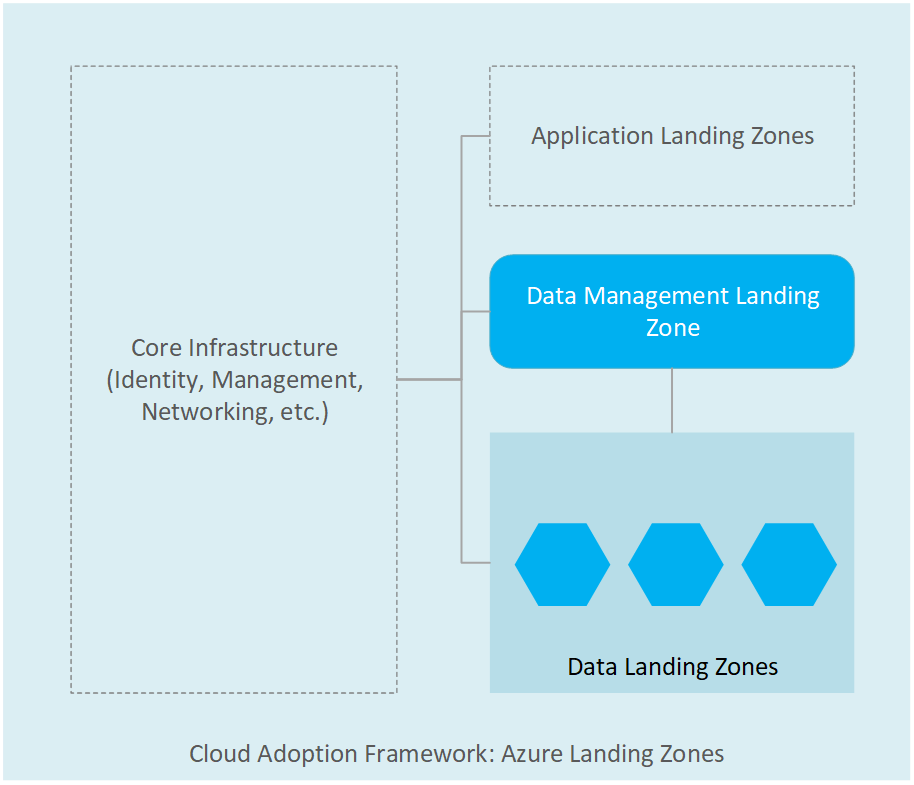

### **Landing Zone Accelerator for Modernizing your Data Estate with Azure SQL**

#### (Duration - 24 Hours) *Duration is an approximate, can be adjusted

[Learning Path and Accreditation](https://aka.ms/DAISP1CS2LZALP) 

#### **A. Objective**

- Document any key design decisions.
- Set up an Azure landing zone based on the Cloud Adoption Framework Enterprise Scale reference architecture.
- Make sure that the workload deployment will comply with technical and non-technical considerations in the Cloud environment.  

#### **B. Pre-requisites**

> **Note**
>
> Before you deliver this engagement please make sure that you are accredited for this VBD. In order to have a successful delivery, please review the prerequisites carefully.

For Azure Landing Zone specifically, check with account team internally and with the customer on the following:

1. Does the customer require an Azure landing zone for the application workload?
1. If yes,make sure Azure Landing Zone Deployment – Design & Implement is a part of the delivery. If accredited, you can deliver as a part of the engagement. Delivery guidance and Delivery content can be found at [here](https://eng.ms/docs/microsoft-customer-partner-solutions-mcaps-core/customer-experience-and-support/customer-success/azure-core/resource-center/alz/intro-alz).This is a **Greenfield** landing zone deployment where the customer needs an application/platform landing zone > deploy the Azure Landing zone reference architecture. Estimated delivery: 3 days. If planning to use this request for the delivery, you also have the option of providing a labor assist to the Azure Core resource who is helping with the Azure Landing zone deployment delivery.

1. For **Brownfield** - the customer has an application/platform landing zone, but it needs to be updated to align with reference standards. Estimated delivery: varies based on workloads.
   - Check if the customer has a landing zone based on ALZ Design standards
   - if unknown, **Use** [Cloud-scale analytics scenario core starter templates](https://docs.microsoft.com/en-us/azure/cloud-adoption-framework/scenarios/cloud-scale-analytics/architectures/deployment-templates)

> **Note**
>
> These steps above are **recommended** if the customer needs the landing zone or already has a landing zone. If this is not needed, then proceed with the execution guide on Application specific landing zone for this customer scenario.**Dispatched** CSA should also engage core/infra CSA for delivery.

[!INCLUDE [Pre-Delivery Checklist](~/VBD-FY24/CommonContent/PredeliveryChecklist.md)]

[!INCLUDE [Customer Scoping](~/VBD-FY24/CommonContent/ScopingGeneral.md)]

  - Verify if the items on the prerequisites section specific to the Azure landing zone is already handled before the call and set expectation on what will be covered for the Data landing zone specific scenario
  - Check if relevant architectural Design is in place whether as a part of the Architecture Design/Review session and what components need to be deployed as a part of this delivery. You may need to fine-tune this, so the template finally developed matches what the customer needs as a part of this delivery
  - Check with the teams involved on what is each person's roles and responsibilities in this area. For example: the networking and infrastructure team will be involved in deciding subnet sizing and how many subnets are needed, user roles and access, etc. The data science team will be involved in discussions around workspace structure and connecting to the workspace from data sources etc.  
    - Some questions that can guide you are below:
    - Is the Core Azure Infrastructure in place or it needs to be built as a part of this Azure Landing Zone Deployment?
    - Which approach is most suitable for deployment? Azure portal or command-line interface or Arm-based template?
    - Enquire about the Application migration plan of the customer? Do they have to test application connectivity as part of the post-deployment activity?
  - It would be a good idea to recommend a high-level plan on how you plan to handle this engagement, and what type of services, training, delivery, etc. would you be planning. Also roughly a ballpark range of the duration of engagement (to help plan customers accordingly from their side).
  - Verify Access to the Customer Environment
    - Check if the customer has access to an Azure Subscription with which the Landing Zone Deployment can happen.

  At the end of scoping, set clear expectations on what is in scope and what is out of scope with the customer. Use the table below as a guide:

  | **In Scope**  |
  |---------      |
  |Azure Landing Zone for workloads such as Azure SQL  |
  |Azure Landing Zone for platform deployment          |
  
  | **Out of Scope**  |
  |---------          |
  |Azure Landing Zone Deployment for workloads other than what is mentioned in scope  |
  |Activities out of scope in this MCEM phase |
  
  | **Success Criteria** 🏅 |
  |---------         |
  |Landing Zone Deployment is successful based on workloads in this scenario such as Azure SQL |

#### **C. Target Audience**

- Project sponsor and project manager
- Applications architects
- Networking Specialist with knowledge on both on-premises and Azure networking & connectivity
- Operations team in charge of maintaining the workload in scope
- Technical leaders responsible for making decisions about the in-scope functional areas
- Any major stakeholder who would be impacted by the Solution. In this customer scenario, other stakeholders are data management team, data science team, infrastructure team may need to be part of the conversation.

#### **D. Execution**

In order to assist the customer with this scenario various engagement options are mentioned below.  You are not limited to the below engagements.  You are more than welcome to add, develop, customize, and leverage other documentation, training, and content from other scenarios that can help you deliver this successfully.

- Design and implement a Microsoft Azure landing zone reference architecture. The resultant landing zone will support most Azure workloads and scale out as your needs evolve. Review [Azure landing zone](https://learn.microsoft.com/en-us/azure/cloud-adoption-framework/ready/landing-zone/) and [Journey to Azure Landing zone](https://learn.microsoft.com/en-us/azure/cloud-adoption-framework/ready/landing-zone/landing-zone-journey) to get an idea of how to schedule and space this engagement based on customer availability and timelines
- Use Azure Resource Manager (ARM) templates or HashiCorp Terraform to deploy, and Azure policies to configure your landing zone. An Azure landing zone will enable you to migrate applications, modernize, and innovate at an enterprise scale in Azure.
- Set up a landing zone based on the Cloud Adoption Framework Enterprise Scale reference architecture
- Ensure the workload deployment will comply with technical and non‐technical considerations in the Cloud environment
- Deploy data management and analytics workloads using a Cloud-scale analytics scenario of the Cloud Adoption Framework (CAF)
- Configure the templates and policies based on your design decisions and deploy your landing zone architecture
- Understand the relationship between Azure landing zones and Cloud-scale analytics scenarios components such as the Data management landing zone and the Data landing zone.

>❗**Important**
>
> Azure Landing Zone is much more than Azure SQL resources, so Azure Core team should deploy the Azure Landing Zone before you start working with Azure SQL.

> **Note**
> Our goal is to identify where Azure SQL resources will de deployed. For example: **Subscriptions, resources groups, regions and so on**.

Below are various **deliveries, documents, and other assets** that you can leverage.  Please note you are NOT limited to or bound by the below deliveries.  You have the freedom to use the below deliveries, come up with your own custom deliveries, mix and match, etc. to reach a solution that is favorable to the customer.

| Delivery Type | Delivery Name | Customer Level | Target Audience | Delivery Method|Use Case | Outcome
| --- | --- | --- | --- | --- | ---| ---|
| Design Session*  | [Conceptual Design Architecture](https://learn.microsoft.com/en-us/azure/cloud-adoption-framework/ready/landing-zone/#azure-landing-zone-conceptual-architecture) | Intermediate| Project manager, networking specialist, application architect, data science manager, data science team, data engineering team,Machine learning operations team  | Design Sessions | Conceptual Architecture on the ALZ deployment to be modified as necessary  | After a few sessions with the customer, update your copy of the Visio with the final design for application ALZ deployment
| Design Session*  | [Data Management Landing Zone Architecture](https://learn.microsoft.com/en-us/azure/cloud-adoption-framework/scenarios/cloud-scale-analytics/architectures/data-management-landing-zone) | Intermediate| Project manager, networking specialist, application architect, data science manager, data science team, data engineering team,Machine learning operations team  | Design Sessions | Conceptual Architecture on the Data Management Landing Zone to be modified as necessary  | After a few sessions with the customer, update your copy of the Visio with the final design of Data Management Landing Zone
| Templates  | [Cloud Scale Analytics Starter templates](https://learn.microsoft.com/en-us/azure/cloud-adoption-framework/scenarios/cloud-scale-analytics/architectures/deployment-templates) | Intermediate| Project manager, networking specialist, application architect, data science manager, data science team, data engineering team,Machine learning operations team  | Template Review | Deployment templates to be evaluated with the customer on their  specific use case  | Select a template that the customer is using as-is or modifying according to their needs
| Templates  | [Data Product](https://github.com/Azure/data-landing-zone) | Intermediate| Project manager, networking specialist, application architect, data science manager, data science team, data engineering team,Machine learning operations team  | Template Review | **Data Product** template to be evaluated for Data Workload |  **Data Product** that the customer is using as-is or modifying according to their needs |

What is marked as an *(asterisk) may already have been done in previous stages such as Architecture Design Sessions, and Review sessions. In that case, these may be skipped. Similarly, the training mentioned is optional as are other documents and delivery assets if the customer has already gone through those in the previous MCEM phases.

#### **E. Closeout 🏁**

You can find the closeout PowerPoint template [on SharePoint.](https://aka.ms/DATAAI-IP/Closeout)

Send the documents to the customer.

#### **F. Additional References 📖**

- Azure landing zones
  - [What is an Azure landing zone?](https://docs.microsoft.com/en-us/azure/cloud-adoption-framework/ready/landing-zone/)
  - [Journey to target architecture](https://docs.microsoft.com/en-us/azure/cloud-adoption-framework/ready/landing-zone/landing-zone-journey)

- Cloud-scale analytics
  - [Cloud-scale analytics overview](https://docs.microsoft.com/en-us/azure/cloud-adoption-framework/scenarios/cloud-scale-analytics/)

- Architectures
  - [Data management landing zone](https://docs.microsoft.com/en-us/azure/cloud-adoption-framework/scenarios/cloud-scale-analytics/architectures/data-management-landing-zone)
  - [Data landing zone](https://docs.microsoft.com/en-us/azure/cloud-adoption-framework/scenarios/cloud-scale-analytics/architectures/data-landing-zone)

- Best practices for [data ingestion](https://docs.microsoft.com/en-us/azure/cloud-adoption-framework/scenarios/cloud-scale-analytics/best-practices/data-ingestion), the [data lake](https://docs.microsoft.com/en-us/azure/cloud-adoption-framework/scenarios/cloud-scale-analytics/best-practices/data-lake-overview) in Cloud-scale analytics.

#### Appendix

Review the documents and assets below to help you. 
    [Azure Landing Zone Educate](https://eng.ms/docs/microsoft-customer-partner-solutions-mcaps-core/customer-experience-and-support/customer-success/azure-core/resource-center/alz/alzedu_vbdguide)
   [Azure Landing Zone Assessment](https://eng.ms/docs/microsoft-customer-partner-solutions-mcaps-core/customer-experience-and-support/customer-success/azure-core/resource-center/alz/alza_vbdguide)
    [Azure Landing Zone Deployment](https://eng.ms/docs/microsoft-customer-partner-solutions-mcaps-core/customer-experience-and-support/customer-success/azure-core/resource-center/alz/alzd_vbdguide)

