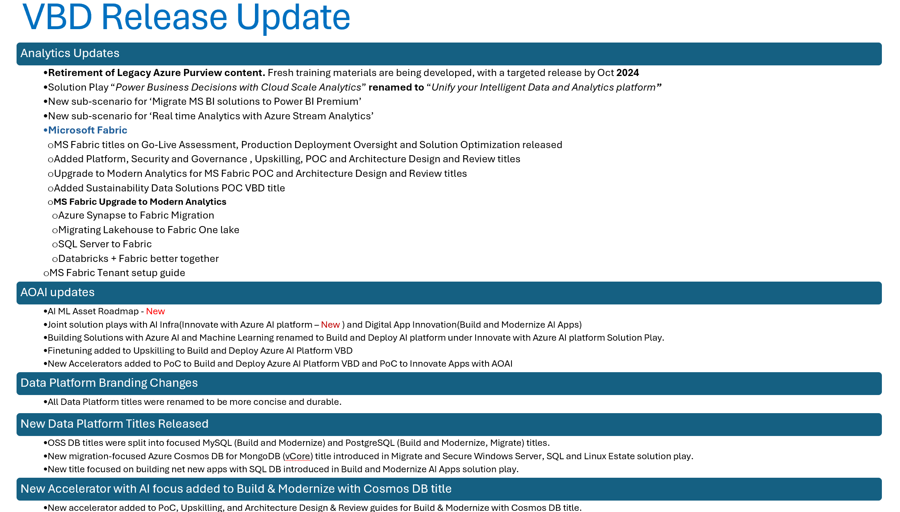

# CSU Data & AI Value Based Deliverable Guidance

> [!IMPORTANT]
> Important News & Announcements 
> Some text ...

### VBD Release Information

Please review change logs and additional information below.

> For more information on VBDs and FY23 Data & AI CSU Strategy please visit the following sites:
> - [Connected Customer Experience VBD Page](https://microsoft.sharepoint.com/teams/connectedcustomerexperiencestrategy/sitepages/vbd.aspx)  
> - [CSU Data & AI - CSA Execution Page](https://microsoft.sharepoint.com/teams/CSUDataAI/SitePages/CSA-Landing.aspx)

 

## List of Priority VBD Scenarios

These prioritized VBD scenarios are broadly applicable to all our customers and should be proactively executed in all accounts.

### [Unify your Intelligent Data and Analytics Platform](./01-PwrBusDecsnCldSclAnalytics/readme.md)
| VBD Scenario                                            | Delivery Guide | Aligned Technology          |
| ------------------------------------------------------------ | -------------- |---------------------|
| [Deploying Microsoft Fabric](./01-PwrBusDecsnCldSclAnalytics/05-MSFabric/readme.md) **New** |[Deploying Microsoft Fabric](./01-PwrBusDecsnCldSclAnalytics/05-MSFabric/readme.md)|Microsoft Fabric |
| [Deploying Analytics with Scalable Lakehouse Architecture](./01-PwrBusDecsnCldSclAnalytics/01-DplyAnalMIDPLkhs/readme.md) |[Lakehouse Architecture with Azure Databricks + Synapse](./01-PwrBusDecsnCldSclAnalytics/01-DplyAnalMIDPLkhs/01-DbxSyn/readme.md)  |Azure Databricks + Synapse|
| [Deploying Real-time Analytics with ADX](./01-PwrBusDecsnCldSclAnalytics/02-DplyRlTmAnalADX/readme.md) |[Deploying Real-time Analytics with ADX](./01-PwrBusDecsnCldSclAnalytics/02-DplyRlTmAnalADX/readme.md) |ADX |
| [Deploying Power BI Analytics](./01-PwrBusDecsnCldSclAnalytics/04-DplyPBIAnal/readme.md) |[Deploying Power BI Analytics](./01-PwrBusDecsnCldSclAnalytics/04-DplyPBIAnal/readme.md)| Power BI

> [!Note] 
> The content from MS Fabric has been relocated to its dedicated scenario and is now separate from the Scalable Lakehouse Architecture, as reflected above.

> [!Important] 
> Legacy Azure Purview VBD Content has been retired.  
>  
> **Introduction of New Purview VBDs (Upskilling, Architecture Design and Review, PoC):** Fresh training materials are being developed, with a targeted release by August 2024 

### [Build and Modernize AI Apps](./02-BldMdrnzAIApps/readme.md)
| VBD Scenario                                            | Delivery Guide | Aligned Technology          |
| ------------------------------------------------------------ | -------------- |---------------------|
| [Build and Modernize Azure Cosmos DB](./02-BldMdrnzAIApps/06-BldMdrnzCsms/readme.md) | [Build and Modernize Azure Cosmos DB](./02-BldMdrnzAIApps/06-BldMdrnzCsms/readme.md) |Azure Cosmos DB
| [Build and Modernize Azure Database for PostgreSQL](./02-BldMdrnzAIApps/07-BldMdrnzPostgres/readme.md) | [Build and Modernize Azure Database for PostgreSQL](./02-BldMdrnzAIApps/07-BldMdrnzPostgres/readme.md) | Azure Database for PostgreSQL
| [Build and Modernize Azure Database for MySQL](./02-BldMdrnzAIApps/08-BldMdrnzMySql/readme.md) | [Build and Modernize Azure Database for MySQL](./02-BldMdrnzAIApps/08-BldMdrnzMySql/readme.md) | Azure Database for MySQL
| [Build and Modernize Azure SQL](./02-BldMdrnzAIApps/09-BldMdrnzSql/readme.md) | [Build and Modernize with Azure SQL DB (New Apps) Sub Scenario](./02-BldMdrnzAIApps/09-BldMdrnzSql/readme.md) | Azure SQL DB
| [Innovating Apps with Azure OpenAI*](./02-BldMdrnzAIApps/05-InnovAppAOAI/readme.md) |[Innovating Apps with Azure OpenAI](./02-BldMdrnzAIApps/05-InnovAppAOAI/readme.md) | Azure Open AI 

> [!Note] 
> Upskilling Execution, Architecture Design and Review, PoC and Production Deployment Oversight under the VBD scenario **Innovating Apps with Azure OpenAI** marked with (*) has moved to App Innovation Solution Area Engineering Hub page and are being redirected accordingly

> [!IMPORTANT]  
> **New** AI ML VBD Asset [Roadmap](https://aka.ms/DATAAI-IP/MLAIRoadmap) released

### [Migrate and Secure Windows Server, SQL and Linux Estate](./05-MigrSecrWinSrvSQLSrvLinux/readme.md)
| VBD Scenario                                            | Delivery Guide | Aligned Technology          |
| ------------------------------------------------------------ | -------------- |---------------------|
| [Migration to Azure Cosmos DB for MongoDB (vCore)](./05-MigrSecrWinSrvSQLSrvLinux/01-MigrToCsms/readme.md) | [Migration to Azure Cosmos DB for MongoDB (vCore)](./05-MigrSecrWinSrvSQLSrvLinux/01-MigrToCsms/readme.md) | Azure Cosmos DB for MongoDB (vCore) |
| [Migration to Azure Database for PostgreSQL](./05-MigrSecrWinSrvSQLSrvLinux/02-MigrToPostgres/readme.md) | [Migration to Azure Database for PostgreSQL](./05-MigrSecrWinSrvSQLSrvLinux/02-MigrToPostgres/readme.md) | Azure Database for PostgreSQL |
| [Build and Modernize Azure SQL](./05-MigrSecrWinSrvSQLSrvLinux/03-MdrnzSql/readme.md) | [Modernization to Azure SQL DB (PaaS) Sub Scenario](./05-MigrSecrWinSrvSQLSrvLinux/03-MdrnzSql/01-MdrnzToSqlDbPaas/readme.md) | Azure SQL DB |
| [Build and Modernize Azure SQL](./05-MigrSecrWinSrvSQLSrvLinux/03-MdrnzSql/readme.md) | [Modernization to SQL Managed Instance (PaaS) Sub Scenario​](./05-MigrSecrWinSrvSQLSrvLinux/03-MdrnzSql/02-AzureSQLMI/readme.md) | Azure SQL MI |
| [Build and Modernize Azure SQL](./05-MigrSecrWinSrvSQLSrvLinux/03-MdrnzSql/readme.md) | [Hybrid - Arc Enabled SQL Server Sub Scenario​](./05-MigrSecrWinSrvSQLSrvLinux/03-MdrnzSql/03-ArcSQLServer/readme.md) | Arc Enabled SQL Server |
| [Migration to SQL Server](./05-MigrSecrWinSrvSQLSrvLinux/04-MigrSql/readme.md) | [Migrate to SQL Server on Azure VM](./05-MigrSecrWinSrvSQLSrvLinux/04-MigrSql/readme.md) | SQL VM Migrations |

### [Innovate with AI Platform *](./04-InnowithAzureAIPlatform/readme.md)
| VBD Scenario                                            | Delivery Guide | Aligned Technology          |
| ------------------------------------------------------------ | -------------- |---------------------|
| [Build and Deploy Azure AI Platform](./04-InnowithAzureAIPlatform/readme.md) |[Azure Machine Learning sub-scenario](./04-InnowithAzureAIPlatform/AML/readme.md)|Azure Machine Learning
|[Build and Deploy Azure AI Platform](./04-InnowithAzureAIPlatform/readme.md) |[Azure AI sub-scenario (AOAI + Azure AI Services + Azure AI Studio)](./04-InnowithAzureAIPlatform/AzureAI/readme.md)|AOAI + Azure AI Services + Azure AI Studio

> [!Note]
> This is a new joint solution play with Azure Infra and Data and AI solution area.  
> The VBD scenario, **Building Solutions with Azure AI and Machine Learning**​ under **Build and Modernize AI Apps** Solution Play is moved under Innovate with AI Platform with enhanced content for LLMOps, AOAI, Azure AI studio along with the existing content 

> [!IMPORTANT]  
> **New** AI ML VBD Asset [Roadmap](https://aka.ms/DATAAI-IP/MLAIRoadmap) released

---

 

## What is a Solution Play, Value Based Delivery(VBD) Scenario and VBD Titles?
- **Solution play** is how we execute business objectives to achieve customer outcomes and enable success. Each solution play may have one or more customer scenarios.
  - The three **solution plays** for Data and AI are mentioned below:
    - *Build and Modernize AI Apps*
    - *Unify your Intelligent Data and Analytics platform*
    - *Migrate and Secure Windows Server, SQL and Linux Estate* 
   

- **VBD Scenarios** focus on solving a customer’s specific pain point by providing a solution through a technical capability. There are 9 VBDs in each customer scenario for Data and AI. 

- **VBD Title** framework aligns the end-to-end customer success delivery plan to the customer’s priorities and the account plan. It ensures all technical work done with customers drives customer priority through our solution plays and VBD scenarios resulting in accelerated customer outcomes. 

    The VBD framework maps the technical MCEM activities to Repeatable IP that enables successful delivery of that activity. VBD is comprised of (up to) 9 MCEM activities that produce deliverables designed to accelerate the customer through their priority and ensuring the resulting solution is aligned to Microsoft recommended practices and optimized for future success.  A Value Based Deliverable is the set of repeatable IP or assets that help accelerate and drive outcomes consistently

---

[!include[General Guidance](~/VBD-FY24/CommonContent/GeneralGuidance.md)]

---

